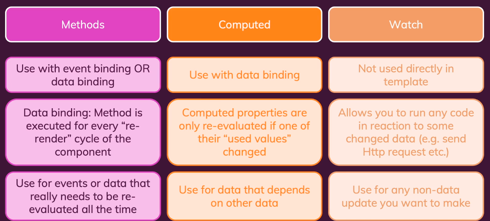

# Vue.js tutorial

You can use Vue to control either your entire page, or just a section of it.

When starting with Vue, then the first thing that you always want to do is connect
a certain part of your app with Vue.

A directive is an instruction that we give to Vue to do something. All built-in 
directives that are shipped with Vue start with a `v-...`.

## Basic data binding
The most basic directive is `v-bind`. This tells Vue to bind a certain HTML attribute
to Vue. So for example `<a v-bind:href="someLinkHref"></a>` would bind the value 
`someLinkHref` that we have defined in our Vue data to the href's value.

Another thing to consider is that you can call any Javascript code inside the HTML
that is being controlled by Vue. So just calling `{{Math.random()}}` is valid code as 
long as it's being controlled by Vue.

You can use the directive `v-html` to tell Vue that whatever is passed into that directive
should be parsed as HTML. However, remember, this is a last resort. Don't reach for it.
This opens up the app to XSS.

```ts
const app = Vue.createApp({
    data() { // This is a keyword for Vue.js. You can set up variables here that
        // Will be connected to the view. Any variable that you use here can be
        // Used in the HTML that Vue is controlling. The variables are defined by
        // The returned object.
        return {
            someVariableForMyView: 'Here is my random variable',
            someLinkHref: 'https://banana.com',
            someHtmlThatWeWantToDefineInAVariable: '<h2>Some HTML</h2>'
        };
    },
    // This one takes an object, not a method. Here you define the methods that become
    // Available in the HTML that is being controlled by Vue.
    methods: {
        // Notice that we do not use fat arrow functions here. someMethod: () => {}
        // This is because the keyword function gets the `this` reference in a different
        // Way.
        // Our methods and our variables can be accessed through the `this` keyword.
        someMethodThatWeWantToUseThatAlsoReturns() {
            return 'Some string ' + this.someVariableForMyView;
        }
    }
});

app.mount('#id-of-the-node-that-we-want-to-control');
```

```html
<section id="i-am-not-controlled-by-vue-but-am-in-the-same-HTML">
    Out of control of Vue.
</section>
<section id="id-of-the-node-that-we-want-to-control">
    <p>{{ Math.random() }}</p>
    <p>{{ someVariableForMyView }}</p>
    <p>{{ someMethodThatWeWantToUseThatAlsoReturns() }}</p>
    <a v-bind:href="someLinkHref">Some link here</a>
    <div v-html="someHtmlThatWeWantToDefineInAVariable"></div>
</section>
```

## Event binding
In order to add event listeners, we use the directive `v-on:...`. We define the
event that we want to bind with. For example, if we want to bind to a click event, then
we use `v-on:click`. This allows you to listen to all the same events that you have
for basic HTML. However, we also need to define what happens when the event happens. 
Similar to the rest of Vue controlled sections, we can define whatever kind of 
Javascript here that we want. Let's say that we have a function, but it can just be
any JS code. `v-on:click="increment"`. In general terms, it can be defined as
`v-on:<event>="<javascript code>"`.

Now, while you can put any JS code in your template, it's a bad practice. You should
have methods there instead, rather than inline large JS chunks.

When you pass a function into `v-on:<event>`, then you can pass it with parenthesis or not.
It works both ways and Vue will do the correct thing. So `v-on:click="increment"`
and `v-on:click="increment()"` both work. However, they have different uses. When
you pass it in without parenthesis `v-on:click="iShallGetTheHtmlEventByDefault"`, 
then Vue fills the parameters in itself with the HTML parameters. So `event` becomes 
its parameter. When you do it with parenthesis `v-on:click="iGetACustomValueAsMyParameter(1337)"`, 
then the value that's being passed into your method is controlled by you. If you 
want to combine both of these approaches, then you can use a reserved keyword called 
`$event`, so `v-on:click="iGetEverything($event, 'Some value')"`

```ts
const app = Vue.createApp({
    data() {
        return {
            canJustModifyAValueDirectlyWithoutAFunction: 0,
            anInputValueThatWeTrack: ''
        };
    },
    methods: {
        methodToIncrementVariableWhichIsTheMoreCorrectApproach() {
            this.canJustModifyAValueDirectlyWithoutAFunction++;
        },
        // So the num that we get here will be the value that WE define in the template
        methodWithAGivenVariable(num) {
            this.canJustModifyAValueDirectlyWithoutAFunction += num;
        },
        // The event that we get here is the event that Vue will pass into the method, as
        // we're passing in a method reference only.
        methodThatGetsTheHtmlEvent(event) {
            this.anInputValueThatWeTrack = event.target.value;
        },
        // The event and custom value that we get here will be coming from the special keyword
        // And the custom value that we pass in through the template.
        methodThatGetsBothAnEventAndACustomValue(event, customValue) {
            this.anInputValueThatWeTrack = event.target.value + customValue;
        }
    }
});

app.mount('#id-of-the-node-that-we-want-to-control');
```

```html
<section id="id-of-the-node-that-we-want-to-control">
    <!-- This is bad practice, but it's an example to be considered. -->
    <button v-on:click="canJustModifyAValueDirectlyWithoutAFunction++">
        Increment
    </button>
    <button v-on:click="methodToIncrementVariableWhichIsTheMoreCorrectApproach">
        Increment correctly
    </button>
    <button v-on:click="methodWithAGivenVariable(5)">
        Increment by 5
    </button>
    <input type="text" v-on:input="methodThatGetsTheHtmlEvent" />
    <input type="text" v-on:input="methodThatGetsBothAnEventAndACustomValue($event, 'Something')" />
    <p>{{ canJustModifyAValueDirectlyWithoutAFunction }}</p>
    <p>{{ anInputValueThatWeTrack }}</p>
</section>
```

Vue has a special directive, that you'll rarely use, but might be useful in certain
situations. It's called `v-once`. It can be used to freeze a value. It will only
get evaluated once, and then it'll simply sit at that value. If you modify the value
somehow, then the value in the section marked with `v-once` will not update.

## Event modifiers
There is a common need in apps to prevent certain default behaviors. For example, 
when you have a form submit, then you often use `event.preventDefault()` to stop
the page from refreshing. Vue provides helpers that are called event modifiers
to do that in the template. For example `v-on:submit.prevent=ourSubmitFunction` can
be used to prevent the default behavior. Otherwise, you'd have to have a 
`ourSubmitFunction` that takes in an event and then calls `event.preventDefault()` on it.

## Key and mouse modifiers
Similar to the even modifiers described above, you'd use a similar syntax, but 
now the idea becomes that you can listen to specific keys. For example, usually
when a button is clicked, then it reacts to a left click. However, if you'd want
the click to react to a right click instead, then you could do 
`v-on:click.right="doSomethingWhenTheRightMouseButtonWasClicked"`. This isn't 
exclusive to clicking, there are a bunch of key events that you can define. 
`v-on:keyup.enter="doSomethingWhenEnterWasPressed"`

## Data binding
You can control the value of an input by using `v-bind` and `v-on`. 
`<input type="text" v-bind:value="someValueOfOurs" v-on:input="methodThatUpdatesOurValue" />`.
However, this is the long way of doing it. This is a common pattern, so there's a shorter
way. You can use `v-model` and this will bind the value and react to changes in the
input. `<input type="text" v-model="someValueOfOurs" />`

## Computed properties
When you have values that you're computing off of other values, then you can use a
thing called computed properties. This is a method that has a dependency list. So Vue
will recalculate the result if any of the dependencies change. To utilize this, you
have to have a separate block in the Vue configuration called `computed`. Unlike React,
however, you don't have to define a dependency list. Vue detects it automatically.

```ts
Vue.createApp({
    data() { 
        return {
            aPropertyWeWantToCalculateFor: 'banana'        
        };
    },
    // It's an object in which you define a bunch of methods.
    computed: {
        // When you name it, you don't name it like a method, you name it like a 
        // property. When you're adding it into the template code, then you'll be
        // adding it like a property. Vue will do the calling.
        // Works similar to React's things with dependencies, however, you don't
        // have to define the dependency list yourself. Vue tracks it automatically.
        computedMethodThatWillBeCalledWhenItsDependenciesChange() {
            // Here the dependency is aPropertyWeWantToCalculateFor
            // So whenever that changes, then this method will be called.
            return this.aPropertyWeWantToCalculateFor + ' potassium';
        }
    }
})
```

```html
<!-- Notice that this does not have parenthesis. We are not calling it. We are providing
 a reference. Vue will do the calling as the dependencies change. -->
<p>{{ computedMethodThatWillBeCalledWhenItsDependenciesChange }}</p>
```

## Watchers
Similar to the previous property, we can react to changes. We can watch for a change
in a certain value and react to it. This would not need to be included in the template.
We need to define a new block for this in the Vue config called `watch`. It takes an
object that's got methods in it. The method name has to be the same as the value that
we are watching for.

A potential use case for this could be sending a request as the input changes. Or if
an input exceeds a certain limit, then we reset it back to the start. Basically
any scenario where you want to react to a value changing.

```ts
Vue.createApp({
    data() { 
        return {
            aPropertyWeAreWatching: ''        
        };
    },
    watch: {
        // Notice that the method name is the same as the data property value that we
        // care about. They need to match. 
        // Also, notice that you get the newValue as the first parameter and the oldValue
        // as the second parameter.
        aPropertyWeAreWatching(newValue, oldValue) {
            
        }
    }
})
```

```html
<input type="text" v-model="aPropertyWeAreWatching" />
```

When considering which approach to use, be it the `methods` block, `computed` block,
or `watch` block, refer to the below table.
