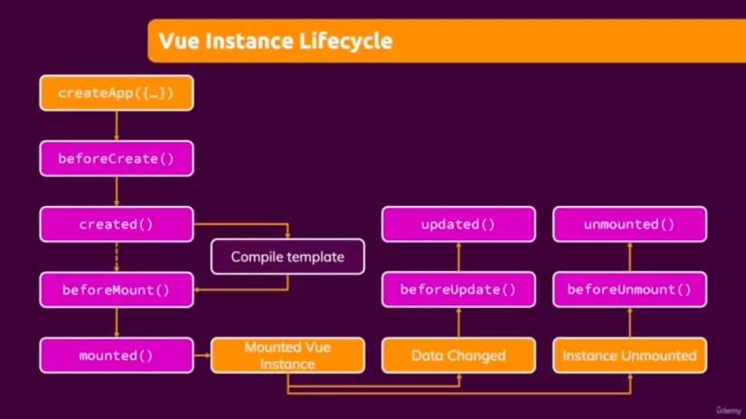

# Vue.js behind the scenes
With the data object that we create, Vue wraps it with a Proxy object, to track whenever
it has been changed.

Two important chapters here are about refs and lifecycles.

## Multiple Vue apps on the same page
You can have multiple Vue apps on your page as well.
```ts
const firstApp = Vue.createApp({
  data() {
    return {
      someValue: 0
    };
  },
  methods: {
    someMethod(num) {
      this.someValue += num;
    }
  }
});

firstApp.mount('#my-wrapper-that-is-controlled-by-vue');
// --------------------------------------------------------------
const secondApp = Vue.createApp({
  data() {
    return {
      someValue: 0
    };
  },
  methods: {
    someMethod(num) {
      this.someValue += num;
    }
  }
});

secondApp.mount('#my-wrapper-that-is-controlled-by-vue-2');
```

```html
<section id="my-wrapper-that-is-controlled-by-vue">
    <button v-on:click="someMethod(10)">Add 10</button>
    <p>{{ someValue }}</p>
</section>
<section id="my-wrapper-that-is-controlled-by-vue-2">
    <button v-on:click="someMethod(10)">Add 10</button>
    <p>{{ someValue }}</p>
</section>
```

## Template
By mounting your app to a certain HTML, you make that  part of the HTML your Vue 
template. Instead of writing the code in HTML, you could use the `template` property
in the Vue object. Most of the time you would not do this, though, because you get 
better IDE support if you do it as we've been doing it in the other examples. However, 
consider the above example, you could re-write it as this:
```ts
const firstApp = Vue.createApp({
  template: `
    <button v-on:click="someMethod(10)">Add 10</button>
    <p>{{ someValue }}</p>
  `,
  data() {
    return {
      someValue: 0
    };
  },
  methods: {
    someMethod(num) {
      this.someValue += num;
    }
  }
});

firstApp.mount('#my-wrapper-that-is-controlled-by-vue');
```

```html
<section id="my-wrapper-that-is-controlled-by-vue">
</section>
```

## Working with refs
Same as with React, you can use a ref to access the DOM element. You can optimize input
value tracking. Instead of having a controlled component where you tell the input
what value it has, based on a string that you have in your data object, you can
have a ref, and then access that DOM element separately from Vue tracking. You can 
use the `ref` key here. You can add any string that you want there. `ref="someRefOfOurs"`,
Notice that for some reason, this property doesn't have a starting `:`. When we want to
access the value in Vue, then we can use `this.$refs.someRefOfOurs`.

```ts
const firstApp = Vue.createApp({
  data() {
    return {
      someValue: 0
    };
  },
  methods: {
    someMethod(num) {
        // This is our DOM element reference
        this.$refs.thisIsOurCustomRef;
        
        // If we want to get the value from the DOM element, then we can use this
        this.$refs.thisIsOurCustomRef.value;
    }
  }
});

firstApp.mount('#my-wrapper-that-is-controlled-by-vue');
```

```html
<section id="my-wrapper-that-is-controlled-by-vue">
    <input type="text" ref="thisIsOurCustomRef" />
</section>
```

## How Vue updates the DOM
Similar to React, it's got a virtual DOM. The virtual DOM is a JS-based DOM, which 
exists only in memory. When an update happens, then the old virtual DOM gets
compared to the new virtual DOM and then a decision is made on what to re-render.

## Vue instance lifecycle
Similar to React, it has lifecycle hooks.


You can subscribe to the methods on the parent level of the configuration object. 
```ts
const firstApp = Vue.createApp({
  beforeCreate() {
    //...
  },
  created() {
    // ...
  }
});
```